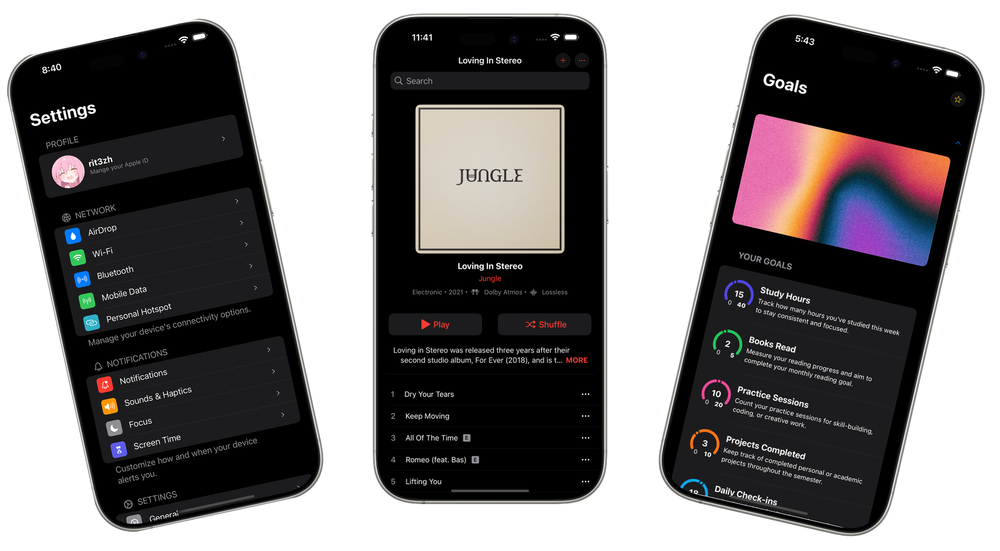

<p align="center">
  
  
</p>

<div align="center">
<h1>SwiftUI Native</h1>
Native iOS components and interactions in React Native powered by SwiftUI and Expo Modules.

</div>

<p align="center">
  
  
  
</p>

<p align="center">
  
</p>

---

> [!NOTE]
> This library is a fork & modified version of [react-native-render-swift-ui](https://www.google.com/url?sa=t&source=web&rct=j&opi=89978449&url=https://github.com/Pflaumenbaum/react-native-render-swift-ui&ved=2ahUKEwi7ovKztfSMAxW-FlkFHVYLGTMQFnoECBsQAQ&usg=AOvVaw2FdxXdPVWD8LF1q5M7knrC).

### 📝 Overview

**SwiftUI Native** brings the best of iOS native experiences directly into your React Native apps. With seamless SwiftUI integration via Expo Modules, you can now use:

- 🚩 **Swipe actions** with full native fluidity
- 📚 **Navigation stacks & modals**
- ⚙️ **Custom native components**
- ✨ **And more—without writing a single line of Swift** in your JS project.

> [!WARNING]
> This library uses **Expo Modules**. Make sure your project is configured with Expo Dev Client or Bare workflow.

---

### 📦 Features

- ✅ Native iOS swipe actions
- ⚙️ Configurable styles, icons & behaviors
- ✨ SwiftUI power, no Swift required
- 📱 Runs with Expo + React Native

---

### 📚 Get Started

```bash
yarn add swiftui-native
```

### 🚀 Prebuild & Run

```bash
# Prebuild your iOS native project
npx expo prebuild -p ios

# Launch on iOS simulator or device
npx expo run:ios
```

### ⚙️ Update iOS Deployment Target

If your Xcode project defaults to iOS 14.0, bump it in your `ios/Podfile`:

```ruby
platform :ios, podfile_properties['ios.deploymentTarget'] || '14.0'
```

> [!WARNING]
> Some components may require **iOS 16.0** or higher.

### 🔗 Autolinking

This package supports React Native’s [autolinking](https://github.com/react-native-community/cli/blob/master/docs/autolinking.md), so you don’t need to manually link anything—just install and you’re ready to go!

---

### 🤝 Contributing

Love what you see? We’d be thrilled to have you contribute:

- ✨ **Feature Requests & Bug Reports**
  Open an issue on [GitHub Issues](https://github.com/rit3zh/swiftui-native/issues)

- 💬 **Discussions & Feedback**
  Join the conversation in [GitHub Discussions](https://github.com/rit3zh/swiftui-native/discussions)

- 📦 **Pull Requests**
  1. Fork the repo
  2. Create a feature branch (`git checkout -b feature/my-feature`)
  3. Commit your changes (`git commit -m "feat: add awesome component"`)
  4. Push to the branch (`git push origin feature/my-feature`)
  5. Open a PR and describe your changes

All contributions—big or small—are welcome! Let’s build something amazing together. 🛠️🎉
